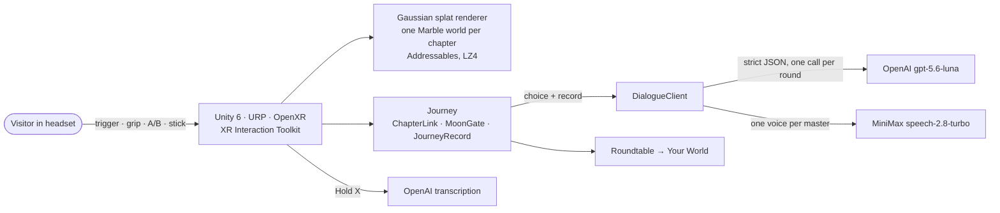

<div align="center">

<h1>MuseXR · MUSE∞ in VR</h1>

**Ask one question. Walk through the museum it becomes — in a headset.**
A native, standalone VR rebuild of [MUSE∞ — The Impossible Museum](https://github.com/SkylarWJY/muse-infinity):
Gaussian-splat worlds you physically walk through, AI masters who stand beside you and answer
in their own voices, and a closing roundtable that reads the walk you actually took.

[](#-play-it)
[](#-built-with)
[](https://www.worldlabs.ai)
[](#-architecture)
[](https://www.minimax.io)
[](https://www.artic.edu/open-access)
[](LICENSE)

</div>

---

## ⏱️ For judges — everything in 60 seconds

**Play it:** install the APK we shared with you, put the headset on, and follow the compass.
No setup, no accounts, nothing to type — point at a question, or hold X and say your own.

```bash
adb install -r MuseXR-Quest-Gate.apk     # or MuseXR-PICO-Gate.apk on a PICO 4
```

**The 10-minute path:** pick a question at the Gate → invite up to three masters → hear them on
the lanterns → walk through the moon gate → in each world, make **one choice** (a bronze to keep,
where to set a lamp, a stroke to add, the hour to stop for) and hear your companions answer it
live → the roundtable turns your walk into one sentence → step into the world it names.

**Controls**

| | |
|---|---|
| **Trigger** | point and select — paintings, masters, lanterns, answers · hold it to paint or to make a copy |
| **Grip** | take hold of things — the bronzes, the lamp, a painting off the wall (two hands to scale it) |
| **A** | keep your choice · skip to the next master while they speak |
| **B** | take it back |
| **Left stick** | walk · **right stick** turn |
| **Hold X** | say your answer out loud, where a question asks for one |

---

## 🌌 What this is

MUSE∞ is a web museum built from one question: you ask something you actually carry, and the
museum curates itself around it, with history's masters walking beside you. **MuseXR takes that
museum off the screen.** It is not a port of the web code — it is a rebuild in Unity against
MUSE∞ as its specification, following SkylarWJY's VR design plan stage by stage, so the whole
walk runs as a standalone APK on the headset itself.

- **The worlds are real places you walk.** Each chapter is a World Labs Marble capture rendered as
  Gaussian splats on the headset's own GPU, with collision, floors and spawn points measured world
  by world.
- **The masters are in the room.** Rigged 3D figures that walk beside you, step out of your way,
  turn to you when they speak — and answer *your* choices live, each through their own lens.
- **Every choice is remembered.** What you kept, where you set the lamp, the hour you stopped for
  — the closing roundtable is built from that record, not from a script.

---

## 🗺️ The journey

| Stop | World | The question it asks | Your one choice |
|---|---|---|---|
| **The Gate** | Glass Conservatory | *What question are you carrying?* | Your question, and up to three masters to walk with |
| **01 · Palace** | Court of Keeping | *Of what I inherited, what is worth keeping?* | A bronze crane or turtle, set in the court and turned how you like — and a reason |
| **02 · Grotto** | Hall of Time | *Facing things that outlast me, how do I see myself?* | Where the lamp goes: close to the carved relief, or out to see the cliff Buddha whole |
| **03 · Van Gogh** | Van Gogh Gallery | *What can my feeling become as expression?* | A colour from the pots, and one stroke painted in the air |
| **04 · Monet** | Water Garden | *What is worth stopping for?* | Turn the time ring — mist, afternoon or dusk — then the painting you stopped for, and why |
| **Roundtable** | — | The masters read your walk back to you | Your answer, in one sentence |
| **Your World** | Shimmering Spheres | *What will you carry back into the life outside?* | A memento — and the arch that starts it all again |

Along the way every painting is interactive: point at it and its card opens; pull the trigger and a
master reads it to you; grip it to take it off the wall; hold the trigger on a hero piece to make a
palm-sized copy for the satchel on your wrist.

---

## ✨ What makes it interesting

| | |
|---|---|
| 🌍 **Splats on a standalone headset** | Marble worlds as Gaussian splats on Quest and PICO, from 24 to **72 FPS** on a Quest 3S intro: visibility-pruned worlds, one sort per frame across both eyes, SH order 0, and the splat layer alone at reduced resolution while text and meshes stay sharp. The full record is in [`PERFORMANCE.md`](PERFORMANCE.md), and why the worlds look the way they do in [`QUALITY.md`](QUALITY.md). |
| 🎭 **Masters who answer you** | Each choice goes to the masters live: one call returns every companion's response to *this* visitor's choice, in their own lens — Monet stages a change in light, Van Gogh speaks to you directly, Socrates answers only in questions. |
| 🗣️ **One voice at a time** | Each master has their own MiniMax voice. A single voice gate guarantees no two lines ever overlap, a skipped line stops its voice, and closing a card silences it. |
| 🧠 **An ending that is earned** | A journey record follows you — the question, your companions, each chapter's choice, the replies you gave, where you lingered. The roundtable quotes it back. |
| 🖐️ **Built for hands** | Grab, turn and seat the bronzes; carry the lamp; take paintings off the wall and scale them with two hands; replicate hero pieces into a wrist satchel. |
| 🧪 **Tested logic** | Every interaction's rules live in engine-free classes with **745 EditMode tests**, so a chapter's flow can be checked without a headset. |

---

## 🏗️ Architecture



- **Logic is engine-free.** Chapter flows (`PalaceFlow`, `GrottoFlow`, …), slot boards, turn-taking
  and the journey record are plain C# with their own tests; the MonoBehaviours are thin shells.
- **Worlds load one at a time** through Addressables, one LZ4 bundle per world, and each chapter's
  frame is re-based to the origin on arrival so precision never drifts.
- **Keys never touch the repo.** A build step copies them from environment variables into
  `StreamingAssets` for the duration of a build and deletes them afterwards; `.gitignore` excludes
  them as a second guard.

## 🛠️ Built with

| | |
|---|---|
| [**Unity 6**](https://unity.com) (6000.3) · URP · OpenXR · XR Interaction Toolkit 3.6 | the app |
| [**PICO Unity OpenXR SDK**](https://developer.picoxr.com) · Meta Quest OpenXR | one project, two build profiles |
| [**Gaussian Splatting for Unity**](https://github.com/aras-p/UnityGaussianSplatting) (Aras Pranckevičius, MIT) | splat rendering, patched for Multi Pass stereo and mobile frame rates |
| [**World Labs Marble**](https://www.worldlabs.ai) | the chapter worlds |
| [**OpenAI**](https://platform.openai.com) `gpt-5.6-luna` · `whisper-1` | the masters' readings, the roundtable, spoken answers |
| [**MiniMax**](https://www.minimax.io) `speech-2.8-turbo` | the masters' voices |
| [**Art Institute of Chicago Open Access**](https://www.artic.edu/open-access) | the paintings on the walls |
| AI-generated 3D models | the masters' bodies, the props, doors and hero pieces |

---

## 🚀 Build it from source

**What you need:** Unity **6000.3.12f1** with Android Build Support, a Quest 3/3S or PICO 4 in
developer mode, and `adb`.

**The worlds are not in this repository.** The Marble splat captures are hundreds of megabytes and
are kept out of git; the code, scenes, models and artwork are all here. The Gate, Van Gogh, Monet
and Your World captures come from MUSE∞'s release; the Palace and Grotto worlds were generated
for this build and are not distributed separately.

```bash
gh release download worlds-v1 -R SkylarWJY/muse-infinity
```

They are converted to Unity splat assets inside the project (500k-splat exports for the headset).
Without them the project opens, compiles and passes its tests, but the chapters have no world.

**Keys** (optional — without them the masters fall back to written lines, clearly marked):

| Environment variable | Unlocks |
|---|---|
| `OPENAI_API_KEY` | live readings, the roundtable, spoken answers |
| `MINIMAX_API_KEY` | the masters' voices |
| `WORLDLABS_API_KEY` | generating a new world on the headset (experimental) |

**Build:** open the project, then

```
MuseXR > Switch To > Quest          (or PICO — wait for the recompile)
MuseXR > Build > Quest > Gate       → Builds/MuseXR-Quest-Gate.apk
```

The whole journey is one scene, `Assets/Scenes/Tests/GateWorld.unity` — press Play to run it in
the Editor (Quest Link works for Play Mode).

**Tests:** `Window > General > Test Runner > EditMode > Run All`.

## 📚 More reading

| | |
|---|---|
| [`PERFORMANCE.md`](PERFORMANCE.md) | every frame-rate measurement on Quest and PICO, and what each change bought |
| [`QUALITY.md`](QUALITY.md) | splat quality limits on standalone headsets |
| [`DYNAMIC-GENERATION.md`](DYNAMIC-GENERATION.md) | generating a Marble world from the headset |
| [`Docs/`](Docs/) | the VR design plan, the Gate walk, door measurements |

## 🛡️ Rights & representation

- The masters are **interpretive AI perspectives**, not the historical people — no quotations, no
  endorsements, no cloned voices.
- Every painting is a public-domain open-access record; the generated "world" paintings inspired
  by modern artists are labelled as AI interpretations, not their work.
- Everything bundled that was not written here is itemised in
  [`THIRD_PARTY_NOTICES.md`](THIRD_PARTY_NOTICES.md).
- No accounts, no tracking. Spoken answers go to the transcription service and nowhere else.

## 🙏 Credits

**MUSE∞** — concept, design, worlds and the VR design plan by
[SkylarWJY](https://github.com/SkylarWJY). **MuseXR** — the VR build by
[saulpena](https://github.com/saulpena), pair-built with AI coding agents (Claude) under human
direction.

Released under the [MIT License](LICENSE).

<div align="center">
<sub>MUSE∞ — because the best answer to a real question is a world you can walk through.</sub>
</div>
